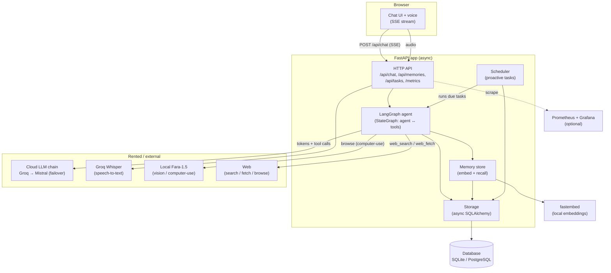

# Architecture

Oli is a single-user personal AI assistant. A FastAPI backend serves a static chat
UI and streams responses over SSE. The "brain" is a LangGraph agent that calls a
cloud LLM (with automatic failover — Groq → Mistral) and a set of tools; long-term
memory and conversation history live in a database (SQLite in dev, PostgreSQL in
production). Computer-use (`browse`) is the one workload on a **local** model — a
self-hosted Fara-1.5 vision model — see ADR 0017.

## System overview

## Request flow (one chat turn)

1. The browser POSTs a message to `/api/chat`; the server opens an SSE stream.
2. `run_turn` persists the user message, seeds the LangGraph agent with history,
   and drives it via `astream_events`.
3. The **agent node** injects the personality prompt + memories relevant to the
   message, then calls the cloud LLM chain (Groq, failing over to Mistral) with the
   tools bound. If a fallback provider answers, a one-time `notice` event tells the user.
4. If the model requests a tool, the **ToolNode** runs it (web search/fetch/browse,
   or memory read/write) and loops back to the agent; otherwise the turn ends.
5. LangGraph's event stream is translated into SSE events (`token`, `tool_start`,
   `tool_end`, `done`) so the UI renders streaming text and tool activity.
6. After the turn, durable facts are extracted to long-term memory in the background.

## Components

| Component | File | Responsibility |
|---|---|---|
| HTTP API | `main.py` | Endpoints, SSE, middleware (request id + metrics), lifespan |
| Agent graph | `agent_graph.py` | LangGraph `StateGraph`, model + tool binding, memory injection |
| Providers | `providers.py` | Cloud LLM chain with failover (Groq → Mistral); tier + structured builders |
| Turn orchestration | `agent.py` | Drives the graph, translates events, persistence, extraction |
| Tools | `tools/` | web_search, web_fetch, browse (local Fara-1.5 computer-use), remember, recall_memory |
| Live browser | `live_browser.py` | CDP screencast → WebSocket; user-driven sessions *and* watching/taking control of a `browse` run |
| Memory | `memory.py`, `embeddings.py` | Embed, dedupe, recall; local fastembed model |
| Storage | `storage.py`, `models.py`, `db.py` | Async SQLAlchemy repository + models + engine |
| Scheduler | `scheduler.py` | Runs proactive tasks on a schedule → notifications |
| Speech-to-text | `stt.py` | Groq Whisper transcription for voice |
| Observability | `metrics.py`, `tracing.py`, `logging_config.py` | Prometheus, LangSmith, structured logs |
| Config | `config.py` | Typed settings (pydantic-settings) |

## Key decisions

The "why" behind the stack is recorded in [Architecture Decision Records](adr/):
the LangGraph migration, Postgres + pgvector, single-user scoping, the swappable
LLM provider, cloud provider failover with a local model for computer-use only
(ADR 0017), the native Fara-1.5 browse engine (ADR 0016), free-tier-first deployment,
the live browser (CDP screencast), and watching/taking control of an autonomous browse.
